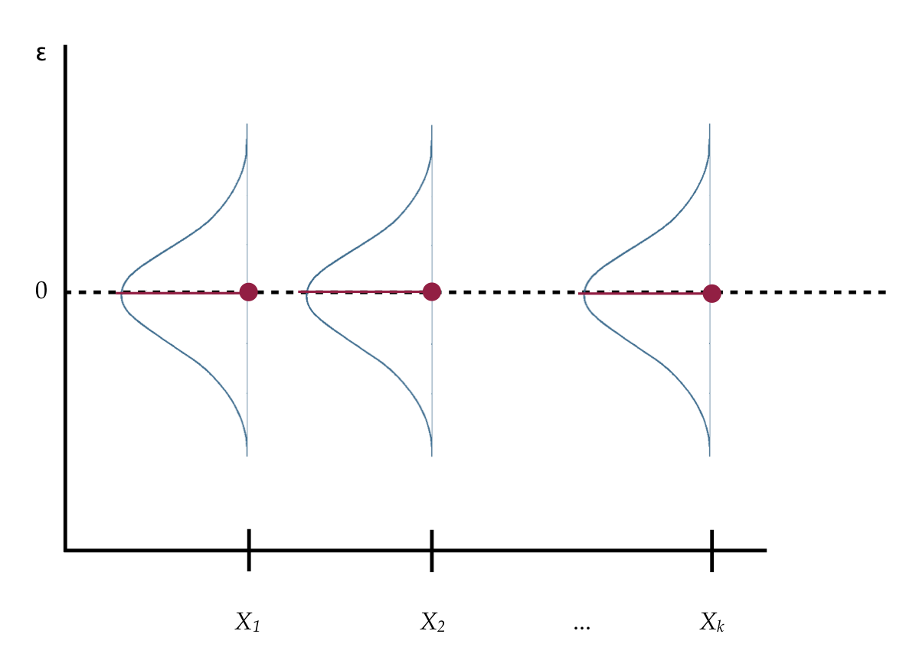

# Probability Distributions

```{r echo=FALSE, message=FALSE}
library(knitr)

opts_knit$set(
  width = 85, 
  tibble.print_max = Inf
  )

opts_chunk$set(
  prompt = FALSE, 
  comment = NA, 
  message = FALSE, 
  warning = FALSE, 
  tidy = FALSE, 
  fig.align = 'center',
  out.width = '50%'
  )
```


In this set of notes, you will learn about common probability distributions.

---

### Preparation {-}

Before class you will need to do the following:

- Read Section 3.1.1: Probability Basics in Fox [Required Textbook] 
- Read Sections 3.3.1&ndash;3.3.4 (Continuous Distributions) in Fox [Required Textbook]

- Refresh your knowledge about probability distributions by going though the [Kahn Academy: Random Variables and Probability Distributions](https://www.khanacademy.org/math/probability/random-variables-topic) tutorial.


<br />

---


## Dataset and Research Question

In this set of notes, we will not be using a specific dataset.

```{r message=FALSE, paged.print=FALSE}
# Load libraries
library(broom)
library(dplyr)
library(ggplot2)
library(readr)
library(sm)
library(tidyr)
```

## Normal Distribution

The probability distribution of a normal distribution is mathematically defined as:

$$
p(x) = \frac{1}{\sigma\sqrt{2\pi}}\exp\left[-\frac{(x-\mu)^2}{2\sigma^2}\right]
$$

for $-\infty \leq x \leq \infty$. Consider a normal distribution with a mean ($\mu$) of 50, and a standard deviation ($\sigma$) of 10. We can compute the probability density ($p(x)$) for a particular $x$ value by using this equation. For example, the probability density for $x=65$ can be found using,

$$
p(65) = \frac{1}{10\sqrt{2\pi}}\exp\left[-\frac{(65-50)^2}{2\times10^2}\right] = 0.01295176
$$

Using R, we can carry out the computation,

```{r}
(1 / (10 * sqrt(2 * pi))) * exp(-(225) / 200)
```

There is also a more direct way to compute this using the `dnorm()` function. This function computes the density of `x` from a normal distribution with a specified `mean` and `sd`.

```{r}
dnorm(x = 65, mean = 50, sd = 10)
```

If we compute the density for several $x$ values and plot them, we get the familiar normal shape; the graphical depiction of the mathematical equation.


```{r out.width='50%', fig.cap='Plot of the probability density function (PDF) for a Normal distribution with mean of 50 and standard deviation of 10. The density value for $x=65$, $p(65)= 0.01295176$, is also displayed on the PDF.'}
# Create dataset
fig_01 = data.frame(
  X = seq(from = 10, to = 90, by = 0.01)
  ) %>% 
  rowwise() %>%
  mutate(
    Y = dnorm(x = X, mean = 50, sd = 10)
    )

# Create plot
ggplot(data = fig_01, aes(x = X, y = Y)) +
  geom_line() +
  theme_bw() +
  geom_point(x = 65, y = 0.01295176, size = 3)
```


### Other Useful R Functions for Working with Probability Distributions

There are four primary functions for working with the normal probability distribution:

- `dnorm()` : To compute the probability density (point on the curve)
- `pnorm()` : To compute the probability (area under the PDF)
- `qnorm()` : To compute the $x$ value given a particular probability
- `rnorm()` : To draw a random observation from the distribution

Each of these requires the arguments `mean=` and `sd=`. Let's look at some of them in use.


### Finding Cumulative Probability

The function `pnorm()` gives the probability $x$ is less than or equal to some quantile value in the distribution; the cumulative probability. For example, to find the probability that $x \leq 65$ we would use,

```{r}
pnorm(q = 65, mean = 50, sd = 10)
```

This is akin to finding the proportion of the area under the normal PDF that is to the left of 65.

```{r out.width='50%', echo=FALSE, fig.cap='Plot of the PDF for a normal distribution (M=50, SD=10) with the cumulative probability for X less than or equal to 65 shaded.'}
# Create dataset
fig_02 = data.frame(
  X = seq(from = 10, to = 90, by = 0.01)
  ) %>% 
  rowwise() %>%
  mutate(
    Y = dnorm(x = X, mean = 50, sd = 10)
    )

# Filter out X<=65
shaded = fig_02 %>%
  filter(X <= 65)

# Create plot
ggplot(data = fig_02, aes(x = X, y = Y)) +
    geom_line() +
    theme_bw() +
    geom_ribbon(data = shaded, ymin = -10, aes(ymax = Y), color = "#bbbbbb", alpha = 0.4)
```

For the mathematically inclined, the grey-shaded area is expressed as an integral

$$
\int_{-\infty}^{65} p(x) dx
$$

where $p(x)$ is the PDF for the normal distribution.


### Cumulative Density and $p$-Value

This type of computation is used most commonly to find a $p$-value. The $p$-value is just the area under the distribution (curve) that is AT LEAST as extreme as some observed value. Consider a hypothesis test of whether a population parameter is equal to 0. Also consider that we observed a statistic (that has been standardized) of $z=2.5$. Then, the $p$-value can be graphically displayed in the standard normal distribution as follows:

```{r out.width='50%', echo=FALSE, fig.cap='Plot of the probability density function (PDF) for the standard normal distribution (M=0, SD=1). The cumulative density representing the p-value for a two-tailed test evaluating whether mu=0 using an observed z-value of 2.5 is also displayed.'}
# Create data
fig_03 = data.frame(
  X = seq(from = -4, to = 4, by = 0.01)
  ) %>% 
  rowwise() %>%
  mutate(
    Y = dnorm(x = X, mean = 0, sd = 1)
    )

# Filter data fro shading
shade_01 = fig_03 %>%
  filter(X >= 2.5)

shade_02 = fig_03 %>%
  filter(X <= -2.5)

# Create plot
ggplot(data = fig_03, aes(x = X, y = Y)) +
    geom_line() +
    theme_bw() +
    geom_ribbon(data = shade_01, ymin = -10, aes(ymax = Y), color = "#bbbbbb", alpha = 0.4) +
    geom_ribbon(data = shade_02, ymin = -10, aes(ymax = Y), color = "#bbbbbb", alpha = 0.4)
```

In most hypothesis tests, we test whether the parameter IS EQUAL to 0. Thus the values in the standard normal distribution more extreme than 2.5 encompass evidence against the hypothesis; those values greater than 2.5 and also those values less than $-2.5$. (This is akin to testing a fair coin when both 8 heads OR 8 tails would provide evidence against fairness \ldots we have to consider evidence in both directions). 

To compute this we use `pnorm()`. Remember, it computes the proportion of the area under the curve TO THE LEFT of a particular value. Here we will compute the are to the left of $-2.5$ and then double it to produce the actual $p$-value.

```{r}
2 * pnorm(q = -2.5, mean = 0, sd = 1)
```

### Finding Quantiles

The `qnorm()` function is essentially the inverse of the `pnorm()` function. The `p` functions find the cumulative probability GIVEN a particular quantile. The `q` functions find the quantile GIVEN a cumulative probability. For example, in the normal distribution we defined earlier, half of the area is below the quantile value of 50 (the mean).

```{r}
qnorm(p = 0.5, mean = 50, sd = 10)
```

## Student's $t$-Distribution

Student's $t$-distribution looks like a standard normal distribution. In the figure below, Student's $t$-distribution is depicted with a solid, black line and the standard normal distribution ($M=0$, $SD=1$) is depicted with a dotted, red line.

```{r out.width='50%', echo=FALSE, fig.cap="Plot of the probability density function (PDF) for the standard normal distribution (dotted, red line) and Student's t-distribution with 5 degrees of freedom (solid, black line)."}
# Create data
fig_04 = data.frame(
  X = seq(from = -4, to = 4, by = 0.01)
) %>% 
  rowwise() %>%
  mutate( 
    Y_t = dt(x = X, df = 5),
    Y_norm = dnorm(x = X, mean = 0, sd = 1)
    )

# Create plot
ggplot(data = fig_04, aes(x = X, y = Y_t)) +
  geom_line() +
  geom_line(aes(y = Y_norm), color = "red", linetype = "dotted") +
  theme_bw() +
  geom_vline(xintercept = 0)
```

Both the standard normal distribution and Student's $t$-distribution have a mean (expected value) of 0. The standard deviation for Student's $t$-distribution is larger than the standard deviation for the standard normal distribution ($SD>1$). You can see this in the distribution because the tails in Student's $t$-distribution are fatter (more error) than the standard normal distribution.

In practice, we often use Student's $t$-distribution rather than the standard normal distribution when we are using sample data to estimate the population. This estimation increases the error and thus is typically modeled using Student's $t$-distribution.

Student's $t$-distribution constitutes a family of distributions---not just a single distribution. The specific shape (and thus probability density) is defined by the *degrees of freedom*; *df*. The plot below shows the standard normal distribution (purple) and four $t$-distributions with varying *df*-values.

```{r out.width='80%', echo=FALSE, fig.width=8, fig.height=6, fig.cap='Plot of several t-distributions with differing degrees of freedom.'}
df_03 = data.frame(
  X = seq(from = -4, to = 4, by = 0.01)
) %>% 
  rowwise() %>%
  mutate( 
    Y_t = dt(x = X, df = 3),
    df = "03"
    )

df_05 = data.frame(
  X = seq(from = -4, to = 4, by = 0.01)
) %>% 
  rowwise() %>%
  mutate( 
    Y_t = dt(x = X, df = 5),
    df = "05"
    )

df_10 = data.frame(
  X = seq(from = -4, to = 4, by = 0.01)
) %>% 
  rowwise() %>%
  mutate( 
    Y_t = dt(x = X, df = 10),
    df = "10"
    )

df_25 = data.frame(
  X = seq(from = -4, to = 4, by = 0.01)
) %>% 
  rowwise() %>%
  mutate( 
    Y_t = dt(x = X, df = 25),
    df = "25"
    )

z = data.frame(
  X = seq(from = -4, to = 4, by = 0.01)
) %>% 
  rowwise() %>%
  mutate( 
    Y_t = dnorm(x = X, mean = 0, sd = 1),
    df = "Standard normal"
    )

fig_06 = rbind(df_03, df_05, df_10, df_25, z)

ggplot(data = fig_06, aes(x = X, y = Y_t, color = df, linetype = df)) +
  geom_line() +
  theme_bw() +
  geom_vline(xintercept = 0) +
  ggsci::scale_color_d3() +
  scale_linetype_manual(values = 5:1)
```


```{r echo=FALSE}
data.frame(
  df = c("03", "05", "10", "25", "z"),
  M = 0.00,
  SD = c(2, 1.5, 1.22, 1.08, 1.00)
)
```

If we compare the means and SDs for these distributions, we find that the mean for all the $t$-distributions is 0, same as the standard normal distribution. All $t$-distributions are unimodal and symmetric around zero. The SD for every $t$-distribution is higher than the SD for the standard normal distribution. Student $t$-distributions with higher *df* values have less variation. It turns out that the standard normal distribution is a $t$-distribution with $\infty$ *df*. For the formula for the SD in a $t$-distribution, see @Fox:2009.

There are four primary functions for working with Student's $t$-distribution:

- `dt()` : To compute the probability density (point on the curve)
- `pt()` : To compute the probability (area under the PDF)
- `qt()` : To compute the $x$ value given a particular probability
- `rt()` : To draw a random observation from the distribution

Each of these requires the arguments `df=`. Let's look at some of them in use.


### Comparing Probability Densities

How do the probability densities for a value of $X$ compare across these distributions? Let's examine the $X$ value of 2.


```{r}
# Standard normal distribution
pnorm(q = 2, mean = 0, sd = 1)

# t-distribution with 3 df
pt(q = 2, df = 3)

# t-distribution with 5 df
pt(q = 2, df = 5)

# t-distribution with 10 df
pt(q = 2, df = 10)

# t-distribution with 25 df
pt(q = 2, df = 25)

```

We are essentially comparing the height of these distributions at $X=2$.

```{r out.width='80%', echo=FALSE, fig.width=8, fig.height=6, fig.cap='Plot of several t-distributions with differing *degrees of freedom. The probability density for t=2 is also displayed for each of the distributions.'}
x2 = fig_06 %>% 
  filter(X == 2)

ggplot(data = fig_06, aes(x = X, y = Y_t, color = df, linetype = df)) +
  geom_line() +
  geom_point(data = x2) +
  theme_bw() +
  geom_vline(xintercept = 0) +
  ggsci::scale_color_d3() +
  scale_linetype_manual(values = 5:1)
```

### Comparing Cumulative Densities

What if we wanted to look at cumulative density? Consider out hypothesis test of whether a population parameter is equal to 0. Also consider that we observed a statistic (that has been standardized) of 2.5 using a sample size of $n=15$. 


If we can assume that the SAMPLING DISTRIBUTION is normally-distributed then we can use the cumulative density in a normal distribution to compute a $p$-value:

```{r}
2 * pnorm(q = -2.5, mean = 0, sd = 1)
```

If, however, the SAMPLING DISTRIBUTION is $t$-distributed then we need to use the cumulative density for a $t$-distribution with the appropriate *df* to compute a $p$-value. For example if we use $df=n-1$, the two-tailed $p$-value would be:

```{r}
2 * pt(q = -2.5, df = 14)
```

The $p$-value using the $t$-distribution is larger than the $p$-value computed based on the standard normal distribution. This is again because of the increased error (uncertainty) we are introducing when we estimate from sample. This added uncertainty makes it harder for us to reject a hypothesis.


## Using the $t$-Distribution in Regression

To illustrate how probability distributions are used in practice, we will will use the *riverview.csv* (see the [data codebook](#riverview) here) and fit a regression model that uses education level and seniority to predict variation in employee income.

```{r message=FALSE, warning=FALSE}
# Read in data
city = read_csv(file = "~/Documents/github/epsy-8252/data/riverview.csv")
head(city)

# Fit regression model
lm.1 = lm(income ~ 1 + education + seniority, data = city)

# Coefficient-level output
tidy(lm.1)
```

How do we obtain the $p$-value for each of the coefficients? Recall that the coefficients and SEs for the coefficients are computed directly from the raw data. Then we can compute a  test-statistic by dividing the coefficient estimate by the SE. For example, to compute the test-statistic associated with education level:

$$
t = \frac{2252}{335} = 6.72
$$

Since we are estimating the SE using sample data, our test statistic is likely $t$-distributed. Which value should we use for *df*? Well, for that, statistical theory tells us that we should use the error *df* value. In our data,

$$
\begin{split}
n &= 32 \\
\mathrm{Total~df} &= 32-1 = 31\\
\mathrm{Model~df} &= 2~\mathrm{(two~predictors)} \\
\mathrm{Error~df} &= 31-2 = 29
\end{split}
$$

Using the $t$-distribution with 29 *df*,

```{r}
2 * pt(q = -6.72, df = 29)
```

For seniority (and the intercept), we would use the same $t$-distribution, but our test statistic would differ:

$$
\begin{split}
t_{\mathrm{Intercept}} &= \frac{6769}{5373} = 1.26 \\
t_{\mathrm{Seniority}} &= \frac{739}{210} = 3.52 \\
\end{split}
$$

The associated $p$-values are:

```{r}
# Intercept p-value
2 * pt(q = -1.26, df = 29)

# Seniority p-value
2 * pt(q = -3.52, df = 29)
```

## Model-Level Inference: The $F$-Distribution

The model-level inference for regression is based on an $F$-statistic, which is a standardized measure of $R^2$.

```{r}
# Model-level output
glance(lm.1)
```

In this example, the sample $R^2$ value is 0.742. Computation of the $F$-statistic relies on two *df* values---the model degrees of freedom (2) and the error degrees of freedom (29). To compute the $F$-statistics from $R^2$ we use:

$$
F = \frac{R^2}{1-R^2} \times \frac{\mathrm{df}_{\mathrm{Error}}}{\mathrm{df}_{\mathrm{Model}}}
$$

In our example, we compute $F$ as:

$$
\begin{split}
F &= \frac{0.742}{1-0.742} \times \frac{29}{2} \\
&= 41.7
\end{split}
$$

We write this standardization of $R^2$ as $F(2,29)=41.7$.

### Testing the Model-Level Null Hypothesis

It is often worth testing whether the model explains a statistically significant amount of variation in the population. To do this we test the null hypothesis:

$$
H_0:\rho^2 = 0
$$

Similar to the tests of the coefficients, we evaluate our test statistic ($F$ in this case) in the appropriate test distribution, in this case an $F$-distribution with 2 and 29 degrees of freedom. (The shape of the $F$-distribution is based on two *df* values.) The figure below, shows the $F(2,29)$-distribution as a solid, black line.

```{r out.width='80%', echo=FALSE, fig.width=8, fig.height=5, fig.cap='Plot of several F-distributions with differing degrees of freedom. The F(2,29)-distribution is shown as a solid, black line.'}
fig_07 = data.frame(
  X = seq(from = 0, to = 5, by = 0.01)
) %>% 
  rowwise() %>%
  mutate( 
    Y_1 = df(x = X, df1 = 2, df2 = 29),
    Y_2 = df(x = X, df1 = 4, df2 = 10),
    Y_3 = df(x = X, df1 = 4, df2 = 100)
    )

ggplot(data = fig_07, aes(x = X, y = Y_1)) +
  geom_line() +
  geom_line(aes(y = Y_2), color = "red", linetype = "dotted") +
  geom_line(aes(y = Y_3), color = "blue", linetype = "dashed") +
  theme_bw() +
  annotate("text", x = 0.4, y = 0.9, label = "F(2, 29)", size = 3) +
  annotate("text", x = 1, y = 0.7, label = "F(4, 100)", size = 3, color = "blue") +
  annotate("text", x = 1, y = 0.57, label = "F(4, 10)", size = 3, color = "red") +
  ylab("Y")
```


The $F$-distribution, like the $t$-distribution is a family of distributions. They are positively skewed and generally have a lower-limit of 0. Because of this, when we use the $F$-distribution to compute a $p$-value, we only compute the cumulative density GREATER THAN OR EQUAL TO the value of the standardized test statistic. 

#### Computing F from the ANOVA Partitioning

We can also compute the model-level $F$-statistic using the partitioning of variation from the ANOVA table.

```{r}
anova(lm.1)
```

The $F$-statistic is a ratio of the mean square for the model and the mean square for the error. To compute a mean square we use the general computation

$$
\mathrm{MS} = \frac{\mathrm{SS}}{\mathrm{df}}
$$

The model includes both the education and seniority predictor, so we combine the SS and df. The MS model is:

$$
\begin{split}
\mathrm{MS}_{\mathrm{Model}} &= \frac{\mathrm{SS}_{\mathrm{Model}}}{\mathrm{df}_{\mathrm{Model}}} \\
&= \frac{4147330492 + 722883649}{1 + 1} \\
&= \frac{4870214141}{2} \\
&= 2435107070
\end{split}
$$

The MS error is:

$$
\begin{split}
\mathrm{MS}_{\mathrm{Error}} &= \frac{\mathrm{SS}_{\mathrm{Error}}}{\mathrm{df}_{\mathrm{Error}}} \\
&= \frac{1695313285 }{29} \\
&= 58459079
\end{split}
$$

Then, we compute the $F$-statistic by computing the ratio of these two mean squares.

$$
\begin{split}
F &= \frac{\mathrm{MS}_{\mathrm{Model}}}{\mathrm{MS}_{\mathrm{Error}}} \\
&= \frac{2435107070}{58459079} \\
&= 41.7
\end{split}
$$

This is the observed $F$-statistic for the model. Note that this is an identical computation (although reframed) as the initial computation for $F$.

$$
\begin{split}
F &= \frac{R^2}{1-R^2} \times \frac{\mathrm{df}_{\mathrm{Error}}}{\mathrm{df}_{\mathrm{Model}}} \\[1em]
&= \frac{\frac{\mathrm{SS}_{\mathrm{Model}}}{\mathrm{SS}_{\mathrm{Total}}}}{\frac{\mathrm{SS}_{\mathrm{Error}}}{\mathrm{SS}_{\mathrm{Total}}}} \times \frac{\mathrm{df}_{\mathrm{Error}}}{\mathrm{df}_{\mathrm{Model}}} \\[1em]
&= \frac{\mathrm{SS}_{\mathrm{Model}}}{\mathrm{SS}_{\mathrm{Error}}} \times \frac{\mathrm{df}_{\mathrm{Error}}}{\mathrm{df}_{\mathrm{Model}}} \\[1em]
&= \frac{\mathrm{SS}_{\mathrm{Model}}}{\mathrm{df}_{\mathrm{Model}}} \times \frac{\mathrm{df}_{\mathrm{Error}}}{\mathrm{SS}_{\mathrm{Error}}} \\[1em]

&= \mathrm{MS}_{\mathrm{Model}} \times \frac{1}{\mathrm{MS}_{\mathrm{Error}}}\\[1em]
&= \frac{\mathrm{MS}_{\mathrm{Model}}}{\mathrm{MS}_{\mathrm{Error}}}
\end{split}
$$

To test the null hypothesis, $H_0:\rho^2=0$, we evaluate this observed $F$-statistic in an $F$-distribution with the 2 and 29 degrees of freedom.

```{r out.width='80%', echo=FALSE, fig.width=8, fig.height=4, fig.cap='Plot of the probability density function (PDF) for the F-distribution with 2 and 29 degrees of freedom. The cumulative density representing the p-value for a two-tailed test evaluating whether rho-squared=0 using an observed F-statistic of 41.7 is also displayed.'}
# Create data
fig_08 = data.frame(
  X = seq(from = 0, to = 50, by = 0.01)
  ) %>% 
  rowwise() %>%
  mutate(
    Y = df(x = X, df1 = 2, df2 = 29)
    )

# Filter shaded area
shade = fig_08 %>%
  filter(X >= 41.7)

# Create plot
ggplot(data = fig_08, aes(x = X, y = Y)) +
  geom_line() +
  theme_bw() +
  geom_ribbon(data = shade, ymin = -10, aes(ymax = Y), color = "#bbbbbb", alpha = 0.4)
```

The computation using the cumulative density function, `pf()`, to obtain the $p$-value is:

```{r}
1 - pf(41.7, df1 = 2, df2 = 29)
```


## Mean Squares are Variance Estimates

Mean squares are estimates of the variance. Consider the computational formula for the sample variance,

$$
\hat{\sigma}^2 = \frac{\sum(Y - \bar{Y})^2}{n-1}
$$

This is the total sum of squares divided by the total *df*. When we compute an $F$-statistic, we are finding the ratio of two different variance estimates---one based on the model (explained variance) and one based on the error (unexplained variance). Under the null hypothesis that $\rho^2 = 0$, we are assuming that all the variance is unexplained. In that case, our $F$-statistic would be close to zero. When the model explains a significant amount of variation, the numerator gets larger relative to the denominator and the $F$-value is larger. 

The mean squared error (from the `anova()` output) plays a special role in regression analysis. It is the variance estimate for the conditional distributions of the residuals in our visual depiction of the distributional assumptions of the residuals underlying linear regression. 

```{r echo=FALSE, out.width='70%', fig.cap='Visual depiction of the distributional assumptions of the residuals underlying linear regression.'}

```


Recall that we made implicit assumptions about the conditional distributions of the residuals, namely that they were identically and normally distributed with a mean of zero and some variance. Based on the estimate of the mean squared error, the variance of each of these distributions is 58,459,079.

While the variance is a mathematical convenience, the standard deviation is a better descriptor of the variation in these distributions. The standard deviation is 7646.

```{r}
sqrt(58459079)
```

We can also obtain this value from the model-level regression output. Here it is typically referred to as the *Root Mean Squared Error* (RMSE). In the `glance()` output this value is in the `sigma` column.

```{r}
glance(lm.1)
```

Why is this value important? It gives the expected variation in the distribution. For example, since all of the conditional distributions of the residuals are normally distributed, we would expect that 95\% of the residuals would fall between $\pm2$ standard errors from 0; or, in this case, between $-15292$ and 15292. Observations with residuals that are more extreme may be regression outliers.


